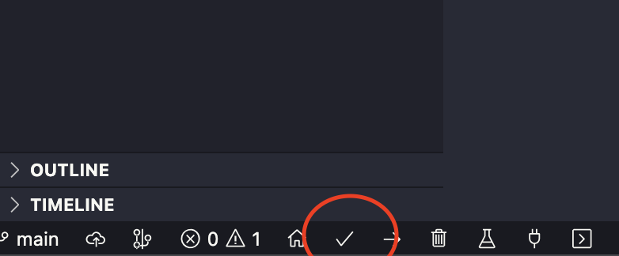
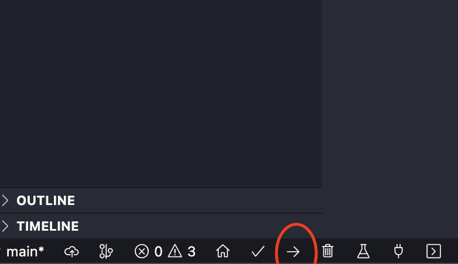

# ThingsBoard

- Aluno: Lucas Dutra Ferreira do Nascimento
- Matrícula: 17/0050939

## Requisitos do projeto

- GCC
- VsCode
- PlatformIO (Biblioteca do VsCode)
- ESP32 (Placa utilizada para o desenvolvimento)
- DHT11 (Sensor de umidade e temperatura)
- SW-520D (Sensor de inclinação)

## Ambiente desenvolvido

O projeto foi desenvolvido em um macOS M1 Monterey 12.6.

## Como executar o projeto

O passo a passo considera que todos os requisitos do projeto foram cumpridos.

1. Conectar a placa ESP32 ao computador

2. Abrir o diretório do projeto utilizando o editor de texto VsCode

3. Com ajuda das ferramentas da biblioteca PlatformIO, compilar o código do projeto

4. Utilizando das ferramentas da biblioteca PlatformIO, faça upload do código para a placa (é necessário pressionar o botão de boot para ativar o modo download)

5. Agora basta reconectar e conectar novamente a placa do computador para o firmware implementado entrar em vigor

6. Acesse o dashboard do [ThingsBoard](http://164.41.98.25:443/dashboards/22d1c780-379d-11ed-be92-e3a443145aec) para ações relacionadas à placa.

## Vídeo de demonstração

https://youtu.be/KCQdUCcqCCU
